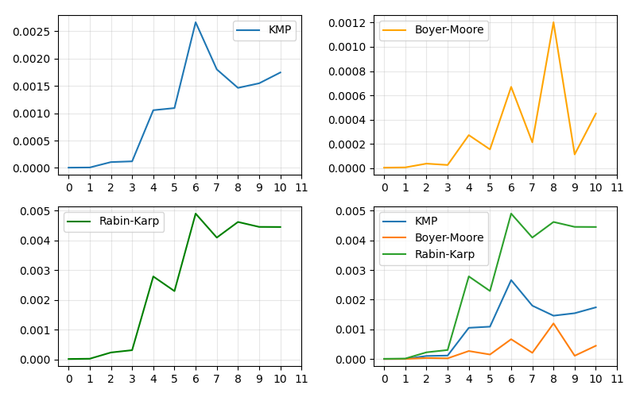
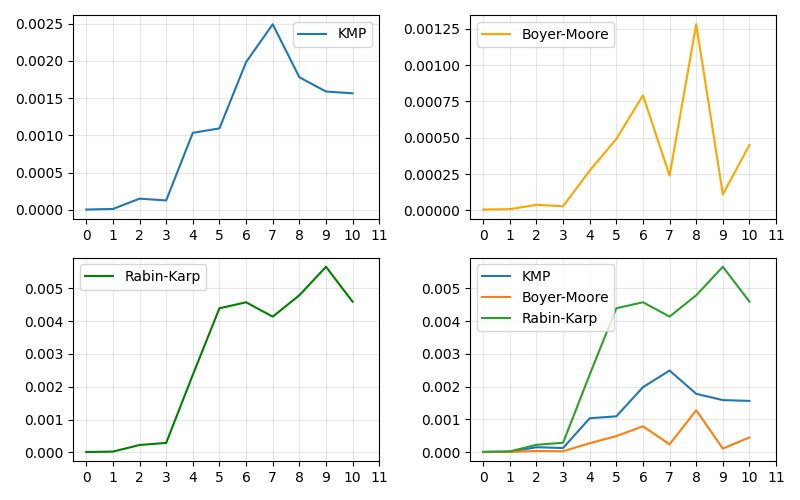
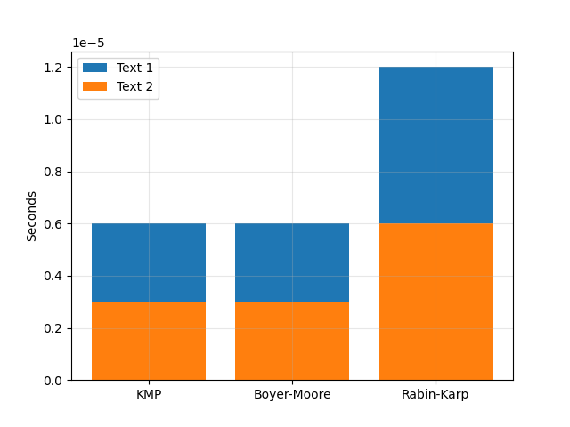

*Ключові слова: алгоритми Бойера-Мура (далі - БМ), Кнута-Морріса-Пратта (далі- КМП), Рабіна-Карпа (далі - РК)*

<b>ЗБІР ДАНИХ</b>

У якості даних для аналізу оберемо з першого та другого текстів наступні категорії слів:
перше слово, перше словосполучення, слово та словосполучення з першої частини тексту (до середини),
середнє слово та словосполучення, слово та словосполучення з другої частини тексту (після середини),
останні слово та словосполучення.

<b>ТЕКСТ 1 "стаття_1.txt"</b>

|  |                  |         |Час пошуку (секунди)|                         |
|--|------------------|----------------  |----------------- |----------------- |
|Id|   Words          | KMP              | Boyer-Moore      | Rabin-Karp       |
|--|------------------|----------------- |----------------  |------------------|
|0 | first-word       |0.0000057600      |0.0000055700      |0.0000150200      |
|1 |first-words       |0.0000091900      |0.0000080600      |0.0000210500      |
|2 |word-beginning    |0.0001165300      |0.0000407100      |0.0002438200      |
|3 |words-beginning   |0.0001436600      |0.0000386400      |0.0002915600      | 
|4 |word-middle       |0.0011220400      |0.0003129000      |0.0024801300      | 
|5 |words-middle      |0.0011545100      |0.0001627700      |0.0032218600      | 
|6 |word-end          |0.0037514800      |0.0039743800      |0.0128815600      |
|7 |words-end         |0.0040740400      |0.0002339100      |0.0044141300      | 
|8 |last-word         |0.0015182400      |0.0012119900      |0.0044996700      |
|9 |last-words        |0.0016907100      |0.0001226100      |0.0047892600      |
|10|word-not-in-text  |0.0016977400      |0.0004613600      |0.0047453900      |

----------------------------------------------------------------------------

<b>ТЕКСТ 2 "стаття_2.txt"</b>

|Id|Words             | KMP              | Boyer-Moore      | Rabin-Karp       |
|--|------------------|----------------- |----------------  |------------------|
|0 |first-word        |0.0000027600      |0.0000030200      |0.0000053600      |
|1 |first-words       |0.0000066800      |0.0000061700      |0.0000155000      |
|2 |word-beginning    |0.0000180700      |0.0000103000      |0.0000370200      |
|3 |words-beginning   |0.0000198500      |0.0000091900      |0.0000449000      | 
|4 |word-middle       |0.0015914000      |0.0005904800      |0.0035866000      | 
|5 |words-middle      |0.0016365100      |0.0002563200      |0.0036253900      | 
|6 |word-end          |0.0022177200      |0.0007769200      |0.0049908800      |
|7 |words-end         |0.0015612400      |0.0002499600      |0.0035452500      | 
|8 |last-word         |0.0030103900      |0.0011541700      |0.0071741300      |
|9 |last-words        |0.0030324600      |0.0004041500      |0.0076513900      |
|10|word-not-in-text  |0.0024401900      |0.0010387500      |0.0078289800      |

Алгоритм БМ має наступний розподіл часу пошуку:

- близьку кількість часу займає пошук елементів: слово та словосполучення середини тексту, словосполучення у другій та кінцевій частинах (від 0.00012 до 0.00024 секунд)
- більше часу треба для пошуку слова, якого немає в тексті (0.0004 секунди) та одного слова у другій частині тексті (0.0007 с)
- найбільше часу займає пошук останнього слова (0.0012 с)

Алгоритм РК має наступний розподіл часу пошуку:
- поступове зменшення швидкості пошуку при віддаленні елементів від середини до кінця (слово середини - 0.002 с, слово в кінцевій частині - 0.004с, останні слова - 0.005 с)

Алгоритм КМП має наступний розподіл часу пошуку:
- зменшення швидкості для елементів середини тексту (0.001 с) та наступних (від 0.002 до 0.0025). Однак, на відміну від алгоритма РК, де час пошуку змінюється до більших значень при віддаленні від середини, алгоритм показує приблизно однаковий час пошуку для елементів, що розташовуються після середини(0.002 с). В результаті найменша швидкість алгоритму КМП (стабілізується при досягненні часу пошуку 0.002 с) складає половину часу, який займає пошук через алгоритм РК при відалленні від середини (змінюється від 0.002 до 0.005 с).

Таким чином, при збільшенні розміру тексту, алгоритм РК показує гірші результати для пошуку віддалених елементів. Можемо зробити висновок, що даний алгоритм є не дуже ефективним для пошуку слів у великих текстах (більше 18000 символів) порівняно з іншими алгоритмами.

**ПОРІВНЯННЯ МІНІМАМАЛЬНОГО ЧАСУ**

**СТАТТЯ 1**

Boyer-Moore швидший за KMP на: 0.00000046 с.

KMP швидший за Rabin-Karp на 0.00000332 с.

Boyer-Moore швидший за Rabin-Karp на 0.00000378 с.

**СТАТТЯ 2**

Boyer-Moore швидший за KMP на: 0.00000070 с.

KMP швидший за Rabin-Karp на 0.00000242 с.

Boyer-Moore швидший за Rabin-Karp на 0.00000172 с.

**ПОРІВНЯННЯ МАКСИМАЛЬНОГО ЧАСУ**

**СТАТТЯ 1**

Boyer-Moore швидший за KMP на: 0.00104263 с.

KMP швидший за Rabin-Karp на 0.00357143 с.

Boyer-Moore швидший за Rabin-Karp на 0.00461406 с.

**СТАТТЯ 2**

Boyer-Moore швидший за KMP на: 0.00165987 с.

KMP швидший за Rabin-Karp на 0.00384316 с.

Boyer-Moore швидший за Rabin-Karp на 0.00550303 с.

Незважаючи на те, що значення мінімальних часів пошуку та їх різниці між алгоритмами дуже малі, алгоритм РК у 10 разів повільніший за КМП та БМ. Однак, для невеликих текстів ця різниця може бути не дуже помітною.

На віддалених частинах тексту різниця є більш сутєвою. Найоптимальнішим виглядає використання алгоритму БМ для більших текстів і найменш ефективним - алгоритму РК.

ВИСНОВКИ:

Усі три алгоритма показують найбільшу швидкість пошуку для слів, що знаходяться на початку текста (перше слово та словосполучення, слово та словосполучення у першій частині тексту). При цьому, як видно з графіків, алгоритм Бойера-Мура (БМ) значно швидший за алгоритми Кнута-Морріса-Пратта (КМП) та Рабіна-Карпа (РК).

У той час, як алгоритм БМ використовує інтервал 10-тисячної долі секунди і тільки при найвищому часі пошуку (останнє слово тексту) досягає тисячної долі секунди, алгоритм КМП починає виконуватись у проміжку тисячної долі секунди, починаючи від середини текста. Алгоритм РК здійснює пошук лише перших елементів за десятитисячні долі секунди, далі - час виконання росте в межах від тисячної долі секунди.

--------------------------------------------------------------------

<b>Список слів, які використовувались для перевірки алгоритмів:</b>

Стаття 1 ("стаття_1.txt")

Кількість символів у статті: 12656

first-word: 'ВИКОРИСТАННЯ'

first-words: 'ВИКОРИСТАННЯ АЛГОРИТМІВ'

word-beginning: 'наприклад'

words-beginning: 'наприклад, сортування: товари в магазині сортують'

word-middle: 'інтерполяції'

words-middle: 'використовує формули інтерполяції'

word-end: 'знаннями'

words-end: 'потрібно володіти фундаментальними знаннями'

last-word: 'html'

last-words: 'https://dl.sumdu.edu.ua/textbooks/95351/522264/index.html'

word-not-in-text: 'no-word-test'

Стаття 2 ("стаття_2.txt")

Кількість символів у статті: 18398

first-word: 'методи'

first-words: 'методи та структури'

word-beginning: 'автор'

words-beginning: 'системи соціальної мережі'

word-middle: 'можливим'

words-middle: 'розв’язувати багато проблем'

word-end: 'генерації'

words-end: 'при традиційних представленнях'

last-word: 'комбинато'

last-words: 'искусство программирования, том 4а. комбинато'

word-not-in-text: 'test-test'

